# 🖥️ Step 1: Lab Setup

## Building Your Virtual Network (The Foundation)

Before we can practice any IT skills, we need computers to practice on! But we're not going to buy 3 real computers - that would be expensive. Instead, we'll create **virtual computers** inside your real computer.

---

## 🤔 Wait, What's a Virtual Machine?

Think of it like this:

| Real World | Virtual World |
|------------|---------------|
| Buying a computer | Creating a VM |
| Installing Windows/Mac | Installing an operating system |
| Computer uses electricity | VM uses your computer's memory/CPU |

**A Virtual Machine (VM) is a computer inside your computer.** It acts just like a real computer, but it's all software!

**Why is this useful?**
- ✅ Free (no hardware to buy)
- ✅ Safe (mess up? just delete and start over)
- ✅ Learn on the same software real companies use

---

## 🎯 What We're Building

By the end of this section, you'll have:

```
YOUR LAPTOP/PC
      │
      ▼
┌──────────────────────────────────────────────────────────┐
│                    VirtualBox                            │
│                                                          │
│   ┌──────────────┐  ┌──────────────┐  ┌──────────────┐   │
│   │              │  │              │  │              │   │
│   │  Controller  │  │    Server    │  │    Client    │   │
│   │  (Ansible)   │  │   (RHEL)     │  │   (RHEL)     │   │
│   │              │  │              │  │              │   │
│   │ 192.168.56.30│  │192.168.56.10 │  │192.168.56.20 │   │
│   └──────────────┘  └──────────────┘  └──────────────┘   │
│              │              │               │            │
│              └──────────────┴───────────────┘            │
│                    Private Network                       │
│                   (192.168.56.0/24)                      │
└──────────────────────────────────────────────────────────┘
```

**In plain English:**
- 3 virtual computers running Red Hat Linux
- All connected to each other on a private network
- The Controller can send commands to the other two

---

## 📋 What You'll Need

### Software (All Free!)

| Software | Purpose | Download Link |
|----------|---------|---------------|
| VirtualBox | Creates virtual machines | [Download VirtualBox](https://www.virtualbox.org/wiki/Downloads) |
| RHEL ISO | The operating system to install | [Red Hat Developer](https://developers.redhat.com/products/rhel/download) |
| Termius | SSH client to connect to VMs | [Download Termius](https://termius.com/) |

### Hardware Requirements

Your computer should have:
- **RAM:** At least 16GB (we'll use ~10GB for VMs)
- **Storage:** At least 100GB free space
- **CPU:** Modern processor with virtualization support

---

## 🚀 Let's Build It!

---

## Step 1.1: Install VirtualBox

1. Go to [virtualbox.org](https://www.virtualbox.org/wiki/Downloads)
2. Download the version for your operating system (Windows/Mac/Linux)
3. Run the installer and click "Next" through everything
4. Restart your computer if asked

**✅ You'll know it worked when:** You can open VirtualBox and see an empty window

---

## Step 1.2: Create the Networks

Before creating VMs, we need to set up HOW they'll communicate. Think of this like setting up the office wifi before bringing in computers.

### Why Two Networks?

| Network | Purpose | Real-World Equivalent |
|---------|---------|----------------------|
| **NAT Network** | Access to internet | Office wifi that reaches the internet |
| **Host-Only Network** | VMs talk to each other | Private office network (no internet) |

### Create the NAT Network (Internet Access)

1. Open VirtualBox
2. Click **File** → **Tools** → **Network**

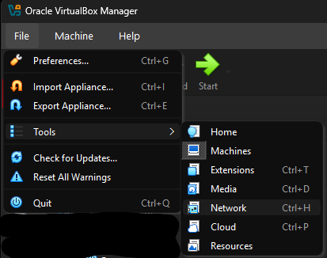

3. Click the **NAT Networks** tab
4. Click **Create** (the + icon)
5. Configure it:
   - **Name:** `NetNat`
   - **IPv4 Prefix:** `10.0.2.0/24`
   - **Enable DHCP:** ✅ Checked

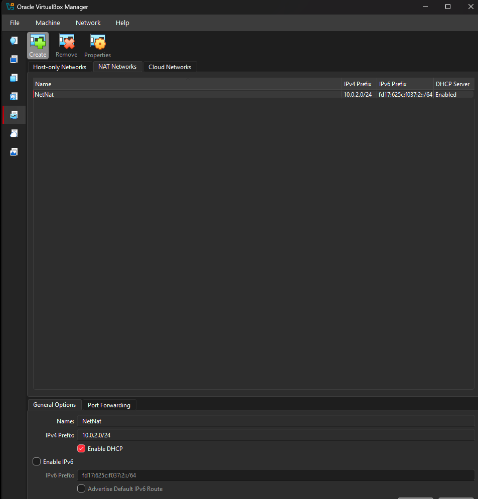

**What does this mean?**
- This network lets VMs download updates from the internet
- DHCP means IP addresses are assigned automatically

### Create the Host-Only Network (Private Network)

1. Click the **Host-only Networks** tab
2. Click **Create** (the + icon)
3. Configure it:
   - **IPv4 Address:** `192.168.56.1`
   - **IPv4 Network Mask:** `255.255.255.0`
   - **DHCP Server:** ❌ Unchecked (we'll set IPs manually)

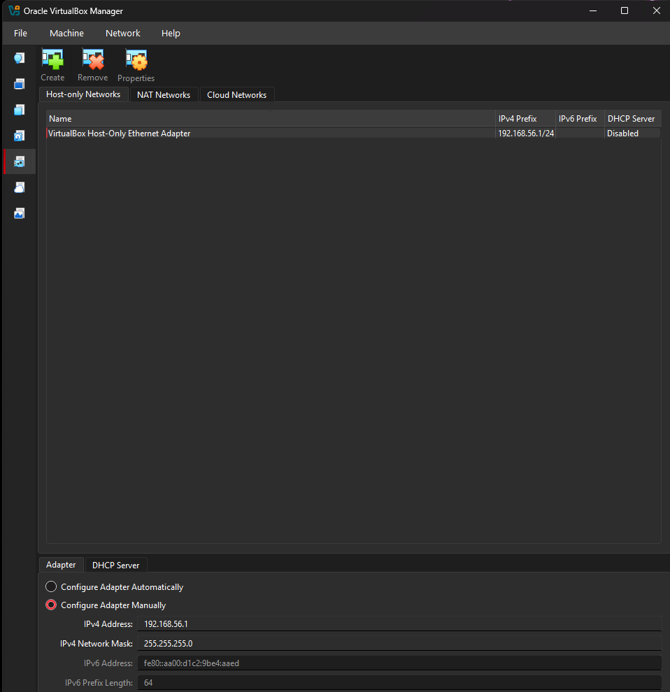

**What does this mean?**
- This is a private network ONLY for your VMs
- No internet access, just VM-to-VM communication
- We turn off DHCP because we want to control the IP addresses

---

## Step 1.3: Download RHEL

1. Go to [Red Hat Developer](https://developers.redhat.com/)
2. Create a free account (it's free, I promise!)
3. Download **Red Hat Enterprise Linux 9** (the ISO file)
4. Save it somewhere you'll remember (like Downloads folder)

**💡 What's an ISO file?**
Think of it like a DVD in digital form. It contains everything needed to install the operating system.

---

## Step 1.4: Create the First VM (Server)

Now let's create our first virtual computer!

### Basic Settings

1. In VirtualBox, click **New**
2. Fill in:
   - **Name:** `RHEL-Server`
   - **Folder:** (leave default)
   - **ISO Image:** (leave empty for now)
   - **Type:** `Linux`
   - **Version:** `Red Hat (64-bit)`

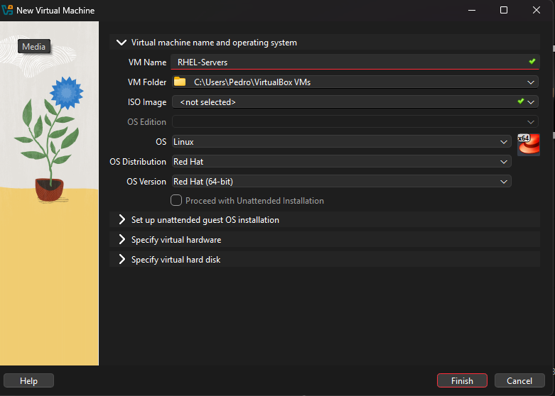

### Hardware Settings

3. Click **Hardware** or continue to next screen
4. Set:
   - **Base Memory:** `4096 MB` (that's 4GB)
   - **Processors:** `2` CPUs

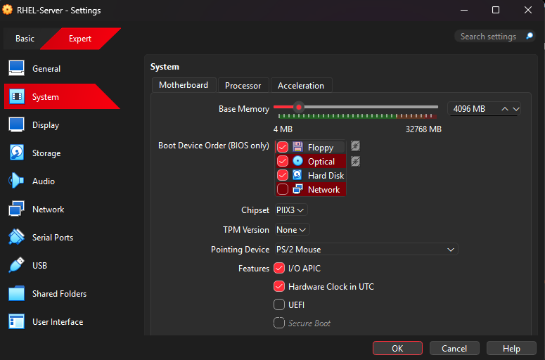
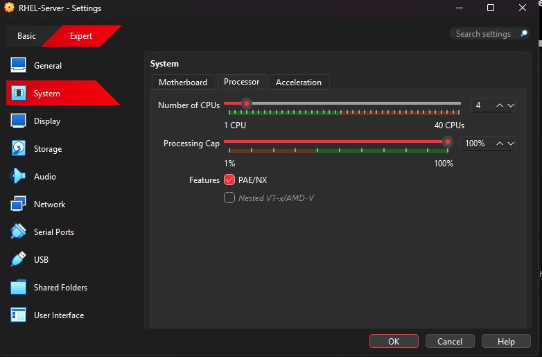

**Why these specs?**
- 4GB RAM: Enough to run the server smoothly
- 2 CPUs: Helps things run faster

### Storage Settings

5. Click **Hard Disk** or continue
6. Set:
   - **Create a Virtual Hard Disk Now:** ✅ Selected
   - **Disk Size:** `40 GB`
   - **Hard Disk File Type:** `VDI`

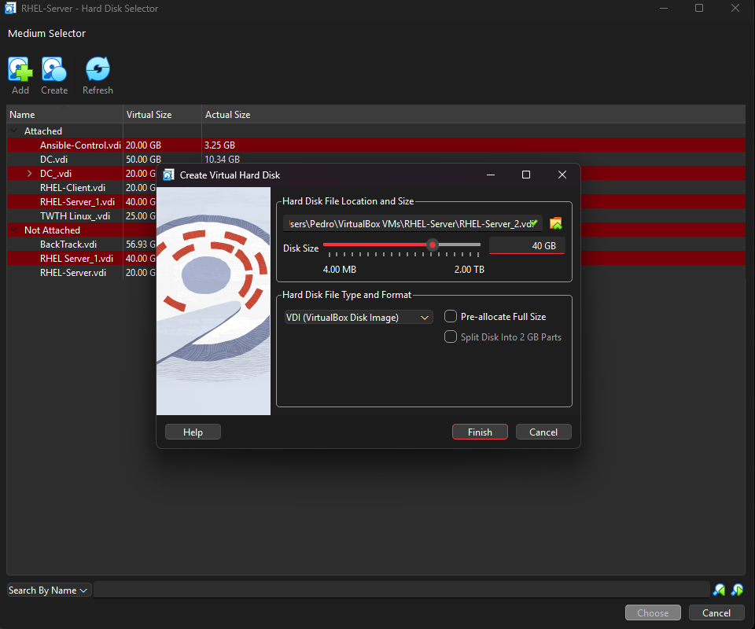

**Why 40GB?**
- The Server needs more space for applications and logs

### Network Settings (IMPORTANT!)

7. After creating, right-click the VM → **Settings**
8. Click **Network**
9. Configure **Adapter 1:**
   - **Enable Network Adapter:** ✅ Checked
   - **Attached to:** `NAT Network`
   - **Name:** `NetNat`

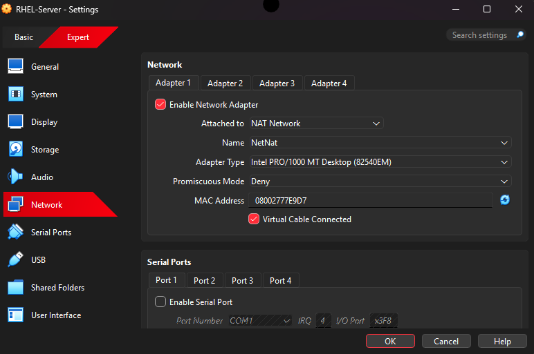

10. Configure **Adapter 2:**
    - Click the **Adapter 2** tab
    - **Enable Network Adapter:** ✅ Checked
    - **Attached to:** `Host-only Adapter`
    - **Name:** `VirtualBox Host-Only Ethernet Adapter`

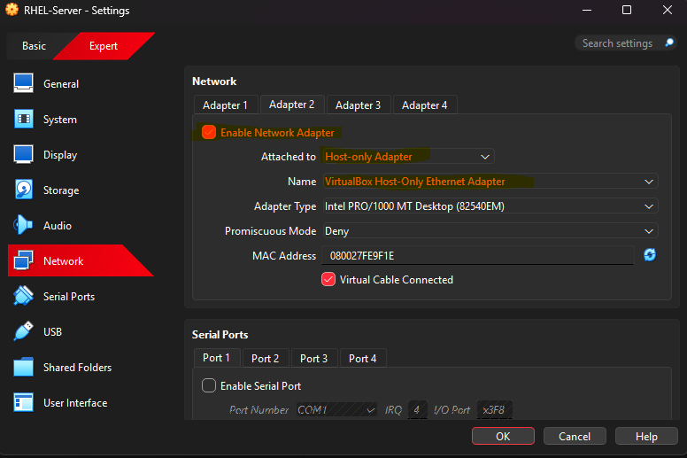

11. Click **OK**

---

## Step 1.5: Create the Other VMs (Client & Controller)

Repeat the same process for two more VMs:

### RHEL-Client

| Setting | Value |
|---------|-------|
| Name | `RHEL-Client` |
| Memory | `2048 MB` (2GB) |
| CPUs | `1-2` |
| Disk | `25 GB` |
| Network | Same as Server (NAT + Host-Only) |

### Ansible-Control

| Setting | Value |
|---------|-------|
| Name | `Ansible-Control` |
| Memory | `2048 MB` (2GB) |
| CPUs | `2` |
| Disk | `25 GB` |
| Network | Same as Server (NAT + Host-Only) |

**💡 Why different specs?**
- **Server:** Most powerful (runs applications)
- **Client:** Medium (simulates a work computer)
- **Controller:** Medium (just sends commands)

---

## Step 1.6: Install RHEL on Each VM

Now we install the operating system. **You'll do this 3 times** (once per VM).

### Start the Installation

1. Select your VM (start with RHEL-Server)
2. Click **Start**
3. When asked for a boot disk, browse to your RHEL ISO file
4. The VM will boot from the ISO

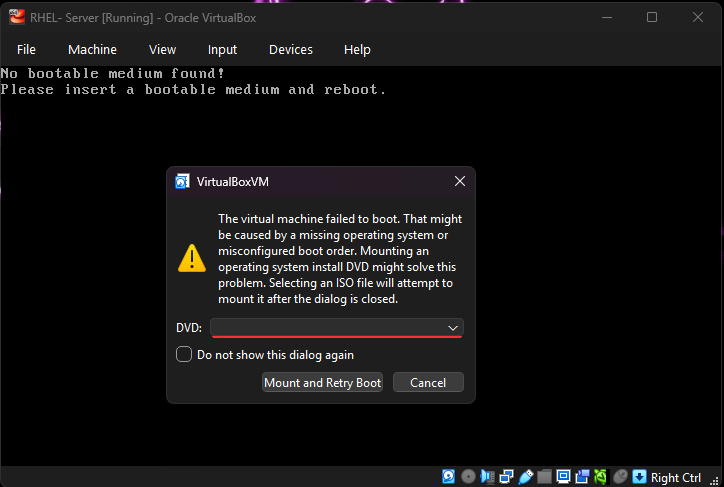

### Installation Wizard

5. Select **Install Red Hat Enterprise Linux**
6. Choose your language and click **Continue**

### Installation Summary Screen

You'll see a screen with multiple options. Here's what to click:

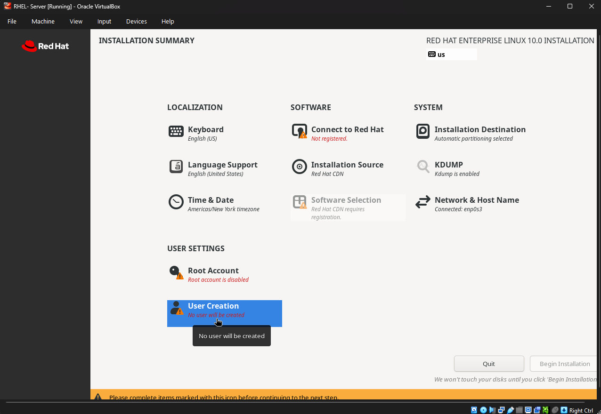

#### Software Selection (IMPORTANT!)

| VM | What to Select |
|----|----------------|
| RHEL-Server | **Server with GUI** |
| RHEL-Client | **Workstation** |
| Ansible-Control | **Minimal Install** |

**Why different selections?**
- Server with GUI: Full graphical environment (easier to see)
- Workstation: Desktop environment for "employee" computer
- Minimal Install: Command-line only (lighter, how real admins work)

#### Installation Destination

- Click it
- Make sure your virtual hard disk is selected
- Click **Done**

#### Connect to Red Hat

- Enter your Red Hat Developer account credentials
- This lets you download updates

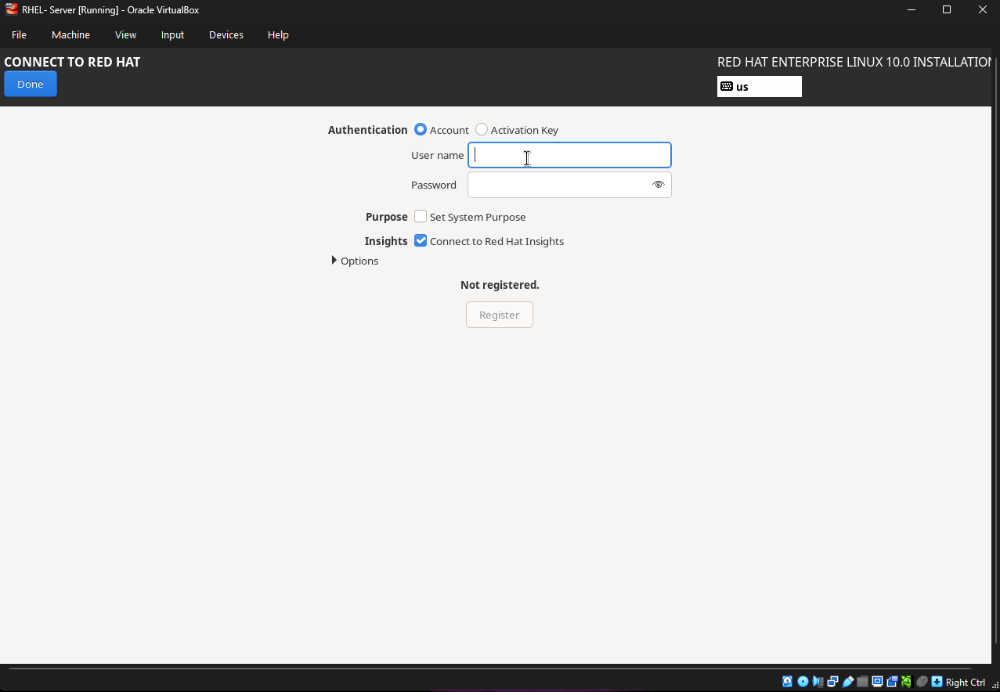

#### Root Password

- Click **Root Account**
- Set a password you'll remember: `Redhat123!`
- Check **Allow root SSH login with password** (for learning only!)

#### User Creation

- Click **User Creation**
- Full name: `Pedro` (or your name)
- Username: `pedro` (lowercase)
- ✅ **Make this user administrator** ← IMPORTANT!
- Set a password

### Begin Installation

- Click **Begin Installation**
- Wait 10-15 minutes
- Click **Reboot System** when done

### Repeat for Other VMs

Do the same for RHEL-Client and Ansible-Control.

---

## Step 1.7: Configure Static IP Addresses

After installation, each VM has a random IP address. We want FIXED addresses so they're always the same.

### Our IP Plan

| VM | IP Address | Hostname |
|----|------------|----------|
| Ansible-Control | `192.168.56.30` | controller |
| RHEL-Server | `192.168.56.10` | server |
| RHEL-Client | `192.168.56.20` | client |

### On Each VM, Run These Commands:

**On Ansible-Control:**
```bash
# Login with your username and password, then:

# See your network connections
nmcli con show

# Set the static IP (the "Wired connection 2" is the Host-Only adapter)
sudo nmcli con mod "Wired connection 2" ipv4.addresses 192.168.56.30/24
sudo nmcli con mod "Wired connection 2" ipv4.method manual
sudo nmcli con up "Wired connection 2"

# Set the hostname
sudo hostnamectl set-hostname controller

# Verify it worked
hostname
ip addr show
```

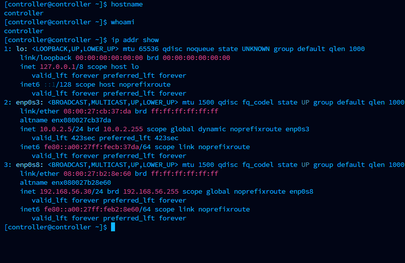

**On RHEL-Server:**
```bash
sudo nmcli con mod "Wired connection 2" ipv4.addresses 192.168.56.10/24
sudo nmcli con mod "Wired connection 2" ipv4.method manual
sudo nmcli con up "Wired connection 2"
sudo hostnamectl set-hostname server
```

**On RHEL-Client:**
```bash
sudo nmcli con mod "Wired connection 2" ipv4.addresses 192.168.56.20/24
sudo nmcli con mod "Wired connection 2" ipv4.method manual
sudo nmcli con up "Wired connection 2"
sudo hostnamectl set-hostname client
```

### Test: Can They Talk to Each Other?

From Ansible-Control, try to "ping" the other VMs:

```bash
ping -c 3 192.168.56.10
ping -c 3 192.168.56.20
```

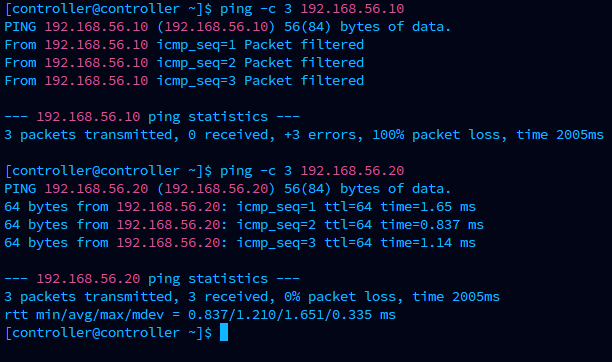

**What you should see:**
- Numbers showing response times
- `0% packet loss` at the end

**If it says "100% packet loss":** Something's wrong with the network setup. Go back and check your network adapters.

---

## Step 1.8: Set Up SSH Keys (Passwordless Login)

SSH keys let the Controller connect to other VMs without typing a password every time.

**Why do we want this?**
- Ansible (automation tool) needs it
- Faster and more secure than passwords

### On the Controller:

```bash
# Generate a key pair (just press Enter for all questions)
ssh-keygen -t rsa -b 4096

# Copy the key to the Server
ssh-copy-id pedro@192.168.56.10

# Copy the key to the Client
ssh-copy-id client@192.168.56.20
```

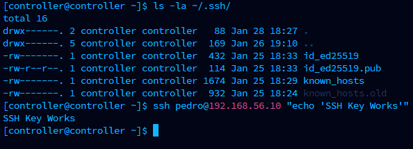

### Test It:

```bash
# This should connect WITHOUT asking for a password
ssh pedro@192.168.56.10 "hostname"
ssh client@192.168.56.20 "hostname"
```

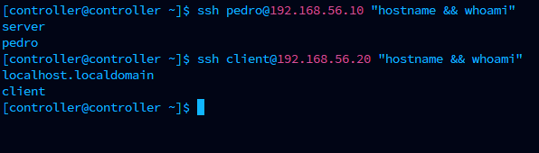

**What you should see:**
- `server` printed (from first command)
- `client` printed (from second command)
- NO password prompts!

---

## ✅ Checkpoint: Is Everything Working?

Run this from the Controller:

```bash
# Check hostname
hostname

# Should print: controller

# Check you can reach Server
ssh pedro@192.168.56.10 "echo 'Server is reachable!'"

# Check you can reach Client
ssh client@192.168.56.20 "echo 'Client is reachable!'"
```

If all three commands work, **congratulations! Your lab is set up!** 🎉

---

## 🔧 Troubleshooting Common Problems

### "I can't ping the other VMs"
- Check that both VMs have the Host-Only adapter enabled
- Make sure the Host-Only network was created correctly
- Verify the IP addresses are set correctly with `ip addr show`

### "SSH asks for a password even after ssh-copy-id"
- Make sure you're using the correct username
- Try running `ssh-copy-id` again
- Check the user exists on the target VM

### "The VM is really slow"
- Make sure you have enough RAM on your host computer
- Close other applications to free up memory
- Reduce VM memory if needed

---

## 📸 Screenshots for This Section

| Screenshot | Description |
|------------|-------------|
| file-tools-network.png | Opening Network Manager |
| nat-network.png | NAT Network settings |
| host-only-network.png | Host-Only Network settings |
| create-vm-server.png | Creating a new VM |
| vm-memory.png | RAM settings |
| vm-cpu.png | CPU settings |
| create-vdi.png | Disk settings |
| vm-network-nat.png | Adapter 1 (NAT) |
| vm-network-hostonly.png | Adapter 2 (Host-Only) |
| boot-iso.png | Booting from ISO |
| installation-summary.png | Installation summary |
| rhel-registration.png | Red Hat registration |
| static-ip-config.png | Setting static IP |
| ping-test.png | Testing connectivity |
| ssh-key-setup.png | SSH key setup |
| verification.png | Final verification |

---

## ➡️ Next Step

Your lab is ready! Let's learn how to manage users:

[Go to Step 2: User Management →](../03-User-Management/)
