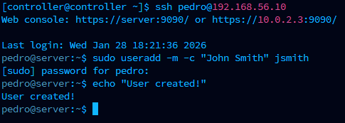
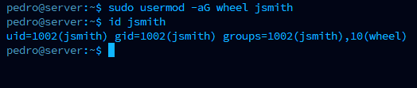
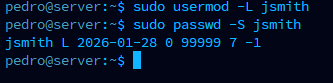
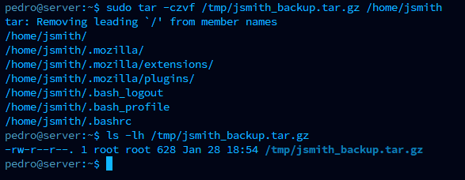
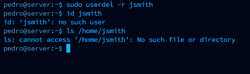

# 👤 Step 2: User Management

## Creating and Managing User Accounts

In any company, employees come and go. As an IT support person, you'll be asked to:
- Create accounts for new employees
- Remove accounts when people leave
- Reset passwords when people forget them

Let's practice these real-world tasks!

---

## 🎯 What You'll Learn

| Task | Real-World Scenario |
|------|---------------------|
| Create a user | "New employee starts Monday" |
| Give admin access | "They need to install software" |
| Lock an account | "Employee is on leave" |
| Delete an account | "Employee has left the company" |

---

## 📋 Scenario 1: New Employee Onboarding

### The Ticket

```
📧 From: HR Department
📋 Subject: New Employee Starting Monday

Hi IT,

We have a new hire starting Monday:
- Name: John Smith
- Username needed: jsmith
- Department: Engineering
- Needs: Admin access to install development tools

Please set up their account on the main server.

Thanks!
HR
```

---

### Step 2.1: Connect to the Server

From your **Controller**, connect to the **Server**:

```bash
ssh pedro@192.168.56.10
```

**What this does:** Opens a remote connection to the Server. You're now typing commands ON the Server, even though you're sitting at the Controller.

---

### Step 2.2: Create the User Account

```bash
sudo useradd -m -c "John Smith" jsmith
```



**Let's break this down:**

| Part | What It Means |
|------|---------------|
| `sudo` | "Run this as administrator" (you'll enter your password) |
| `useradd` | "Create a new user" |
| `-m` | "Make a home folder for them" (like /home/jsmith) |
| `-c "John Smith"` | "Their full name is John Smith" |
| `jsmith` | The username |

**💡 Pro tip:** If nothing prints, that means it worked! Linux is quiet when things succeed.

---

### Step 2.3: Give Them Admin Access

John needs to install software, which requires admin (sudo) access:

```bash
sudo usermod -aG wheel jsmith
```

**What this means:**

| Part | What It Means |
|------|---------------|
| `usermod` | "Modify a user" |
| `-aG` | "Add to a Group" |
| `wheel` | The admin group in RHEL (like "Administrators" in Windows) |
| `jsmith` | Which user to modify |

---

### Step 2.4: Verify It Worked

```bash
id jsmith
```



**What you should see:**
```
uid=1001(jsmith) gid=1001(jsmith) groups=1001(jsmith),10(wheel)
```

**How to read this:**
- `uid=1001(jsmith)` - User ID is 1001, username is jsmith ✓
- `groups=...,10(wheel)` - They're in the wheel (admin) group ✓

---

### Step 2.5: Set Their Password

```bash
sudo passwd jsmith
```

You'll be asked to type a password twice. Use something simple for the lab: `Password123`

**Note:** You won't see the password as you type - that's normal for security!

---

### ✅ Ticket Complete!

You've successfully:
- ✅ Created user `jsmith`
- ✅ Given them a home folder
- ✅ Made them an administrator
- ✅ Set their password

**In a real job, you'd reply to HR:** "Account created! Username is jsmith, temporary password sent separately."

---

## 📋 Scenario 2: Employee Leaving the Company

### The Ticket

```
📧 From: HR Department
📋 Subject: URGENT - Employee Termination

Hi IT,

John Smith (jsmith) is no longer with the company as of today.

Please:
1. Disable his account IMMEDIATELY (security!)
2. Backup his files (legal requirement)
3. Then delete the account

Thanks,
HR
```

**⚠️ This is time-sensitive!** When someone leaves, you lock them out FIRST, then do the cleanup.

---

### Step 2.6: Lock the Account (Do This First!)

```bash
sudo usermod -L jsmith
```



**What `-L` does:** Locks the account so they can't log in anymore.

**Verify it's locked:**
```bash
sudo passwd -S jsmith
```

**You should see:**
```
jsmith LK 2025-01-28 0 99999 7 -1 (Password locked.)
```

The `LK` means **Locked**. John can't log in anymore! 🔒

---

### Step 2.7: Backup Their Files

Before deleting anything, ALWAYS backup first. This is a legal requirement at many companies.

```bash
sudo tar -czvf /tmp/jsmith_backup.tar.gz /home/jsmith
```



**What this does:**

| Part | Meaning |
|------|---------|
| `tar` | A tool for creating archives (like zip files) |
| `-c` | Create a new archive |
| `-z` | Compress it (make it smaller) |
| `-v` | Verbose (show what's happening) |
| `-f` | Filename follows... |
| `/tmp/jsmith_backup.tar.gz` | Save the backup here |
| `/home/jsmith` | What to backup |

**Verify the backup exists:**
```bash
ls -lh /tmp/jsmith_backup.tar.gz
```

You should see the file with its size.

---

### Step 2.8: Delete the User

Now that we have a backup, we can delete the account:

```bash
sudo userdel -r jsmith
```



**What `-r` does:** Removes their home folder too.

**⚠️ Warning:** Without the backup, those files would be GONE forever!

**Verify they're gone:**
```bash
id jsmith
```

**You should see:**
```
id: 'jsmith': no such user
```

---

### ✅ Ticket Complete!

You've successfully:
- ✅ Locked the account immediately (security first!)
- ✅ Backed up their files (legal compliance)
- ✅ Deleted the user and their files

---

## 📖 Command Reference

Here's a cheat sheet of what you learned:

| Task | Command |
|------|---------|
| Create user | `sudo useradd -m -c "Full Name" username` |
| Give admin access | `sudo usermod -aG wheel username` |
| Set password | `sudo passwd username` |
| Check user info | `id username` |
| Lock account | `sudo usermod -L username` |
| Check lock status | `sudo passwd -S username` |
| Backup files | `sudo tar -czvf backup.tar.gz /folder` |
| Delete user + files | `sudo userdel -r username` |

---

## 💡 Key Lessons

1. **Silence = Success** - Linux doesn't always say "done!" If there's no error, it worked.

2. **Lock First, Delete Later** - When someone leaves, disable their access IMMEDIATELY.

3. **Always Backup Before Deleting** - Files can be legally required, and there's no "recycle bin" in Linux.

4. **The `wheel` Group** - In RHEL, this group has admin powers (like Administrators in Windows).

---

## 🔧 Troubleshooting

### "User already exists"
```bash
sudo userdel jsmith
```
Then try creating again.

### "Cannot lock password"
Make sure the user exists:
```bash
id jsmith
```

### "Permission denied"
Make sure you're using `sudo` before the command.

---

## 📸 Screenshots for This Section

| Screenshot | Description |
|------------|-------------|
| useradd.png | Creating the user |
| usermod.png | Adding to wheel group + verification |
| user-lock.png | Locking the account |
| tar-backup.png | Creating the backup |
| userdel.png | Deleting the user |

---

## ➡️ Next Step

Great job! Now let's learn how to fix things when they break:

[Go to Step 3: Service Troubleshooting →](../04-Service-Troubleshooting/)
