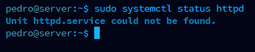
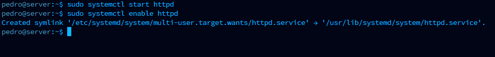
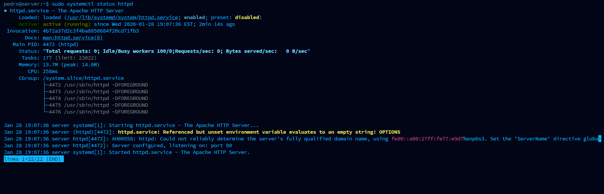

# ⚙️ Step 3: Service Troubleshooting

## Fixing Things When They Break

This is the CORE of IT support - things break, and you fix them!

In this section, you'll learn how to diagnose and fix a web server that's down. This is one of the most common issues you'll face in a real job.

---

## 🤔 What's a "Service"?

Think of services like apps that run in the background:

| Service | What It Does | Real-World Example |
|---------|--------------|-------------------|
| `httpd` | Web server | Company website |
| `sshd` | Remote access | How you log in remotely |
| `mysqld` | Database | Stores customer data |

When someone says "the website is down," they usually mean the web server SERVICE isn't running.

---

## 📋 The Scenario: Website Down!

### The Ticket

```
📧 From: Marketing Department
📋 Subject: URGENT!!! Website is DOWN!!!
🚨 Priority: HIGH

Hi IT,

Our company website is completely down! Customers are calling and 
complaining they can't access anything!

This is costing us money every minute it's down. PLEASE FIX ASAP!

Server: 192.168.56.10

- Marketing
```

**This is a high-priority ticket.** In real life, this would be all hands on deck!

---

## 🔍 Investigation Phase

### Step 3.1: Connect to the Server

From your **Controller**:

```bash
ssh pedro@192.168.56.10
```

**First rule of troubleshooting:** Get to the affected machine!

---

### Step 3.2: Check if the Web Server is Running

```bash
sudo systemctl status httpd
```



**What you might see:**

| Message | What It Means |
|---------|---------------|
| `active (running)` | It's working! (not our problem) |
| `inactive (dead)` | It's installed but stopped |
| `failed` | It crashed |
| `could not be found` | It's not even installed! 😱 |

**In our case:** `Unit httpd.service could not be found`

**Root cause found!** The web server isn't installed!

---

## 🔧 Fix Phase

### Step 3.3: Install the Web Server

```bash
sudo dnf install httpd -y
```


**What this does:**

| Part | Meaning |
|------|---------|
| `dnf` | The package manager (like an app store) |
| `install` | What we want to do |
| `httpd` | The web server package |
| `-y` | "Yes to all questions" (don't ask, just do it) |

**You'll see:** A bunch of text showing packages being downloaded and installed, ending with `Complete!`

---

### Step 3.4: Start the Service

Installing doesn't automatically start it! You need to:

```bash
sudo systemctl start httpd
```



**No output = success!**

---

### Step 3.5: Make It Start Automatically on Boot

What if the server restarts? We want the web server to start automatically:

```bash
sudo systemctl enable httpd
```

**You'll see:** `Created symlink...` (that's good!)

---

## ✅ Verification Phase

### Step 3.6: Confirm It's Running

```bash
sudo systemctl status httpd
```



**What you should see:**
```
● httpd.service - The Apache HTTP Server
   Loaded: loaded (/usr/lib/systemd/system/httpd.service; enabled...)
   Active: active (running) since...
```

**Key things to check:**
- `enabled` - Will start on boot ✓
- `active (running)` - Currently working ✓

---

### Step 3.7: Test the Website

```bash
curl http://localhost
```

**What you should see:**
```html
<html>
...
<title>It works!</title>
...
</html>
```

**"It works!"** means the web server is serving pages! 🎉

---

## 📝 Document the Fix

In real IT, you MUST document what you did. Here's how:

```
TICKET #1042 - Web Server Down
================================
PRIORITY: HIGH

CUSTOMER ISSUE:
- Marketing reported website completely down
- Customers unable to access company website

ENVIRONMENT:
- Server: 192.168.56.10

INVESTIGATION:
- Ran: sudo systemctl status httpd
- Found: "Unit httpd.service could not be found"

ROOT CAUSE:
- Web server (httpd) was not installed on server

RESOLUTION:
1. Installed httpd: sudo dnf install httpd -y
2. Started service: sudo systemctl start httpd
3. Enabled on boot: sudo systemctl enable httpd

VERIFICATION:
- Ran: sudo systemctl status httpd
- Result: active (running), enabled
- Website test: curl http://localhost returned "It works!"

STATUS: RESOLVED
Time to Resolution: ~10 minutes

NOTES:
- Recommend adding httpd to standard server checklist
- Consider monitoring for service availability
```

---

## 📖 Command Reference

Here's your troubleshooting toolkit:

| Task | Command |
|------|---------|
| Check if service is running | `sudo systemctl status httpd` |
| Start a service | `sudo systemctl start httpd` |
| Stop a service | `sudo systemctl stop httpd` |
| Restart a service | `sudo systemctl restart httpd` |
| Enable auto-start on boot | `sudo systemctl enable httpd` |
| Disable auto-start | `sudo systemctl disable httpd` |
| Install a package | `sudo dnf install httpd -y` |
| Remove a package | `sudo dnf remove httpd` |

---

## 🔍 Understanding Service Status

```
● httpd.service - The Apache HTTP Server
   Loaded: loaded (/usr/lib/systemd/system/httpd.service; enabled; ...)
                                                          ^^^^^^^^
                                                          Will it start on boot?

   Active: active (running) since Mon 2025-01-27 10:00:00 EST; 5min ago
           ^^^^^^^^^^^^^^^^
           Is it running RIGHT NOW?
```

| Status | Meaning | What to Do |
|--------|---------|------------|
| `active (running)` | Working! | Nothing |
| `inactive (dead)` | Stopped | `systemctl start` |
| `failed` | Crashed | Check logs with `journalctl -u httpd` |
| `not found` | Not installed | `dnf install` |

---

## 🎓 The Troubleshooting Process

```
     ┌─────────────────┐
     │ Report received │
     │ "Website down!" │
     └────────┬────────┘
              │
              ▼
     ┌─────────────────┐
     │ Connect to      │
     │ affected server │
     └────────┬────────┘
              │
              ▼
     ┌─────────────────┐
     │ Check service   │
     │ status          │
     └────────┬────────┘
              │
    ┌─────────┴─────────┐
    │                   │
    ▼                   ▼
┌─────────┐      ┌─────────────┐
│ Running │      │ Not running │
│ (other  │      │             │
│ issue)  │      └──────┬──────┘
└─────────┘             │
              ┌─────────┴─────────┐
              │                   │
              ▼                   ▼
       ┌───────────┐      ┌─────────────┐
       │ Not       │      │ Installed   │
       │ installed │      │ but stopped │
       └─────┬─────┘      └──────┬──────┘
             │                   │
             ▼                   ▼
       ┌───────────┐      ┌─────────────┐
       │ Install   │      │ Start it    │
       │ it        │      │             │
       └─────┬─────┘      └──────┬──────┘
             │                   │
             └─────────┬─────────┘
                       │
                       ▼
              ┌─────────────────┐
              │ Enable on boot  │
              └────────┬────────┘
                       │
                       ▼
              ┌─────────────────┐
              │ Verify & test   │
              └────────┬────────┘
                       │
                       ▼
              ┌─────────────────┐
              │ Document fix    │
              └─────────────────┘
```

---

## 💡 Key Lessons

1. **Start with status** - Always check `systemctl status` first

2. **Install → Start → Enable** - Three steps to get a service fully running

3. **Test your fix** - Don't assume it works; verify!

4. **Document everything** - Future you (or your coworkers) will thank you

---

## 📸 Screenshots for This Section

| Screenshot | Description |
|------------|-------------|
| service-not-found.png | Initial error - httpd not installed |
| dnf-install-1.png | Installing httpd (start) |
| dnf-install-2.png | Installing httpd (complete) |
| service-start.png | Starting and enabling the service |
| service-running.png | Verification - service is running |

---

## ➡️ Next Step

Now let's learn how to automate tasks so you don't have to do them manually on every server:

[Go to Step 4: Ansible Automation →](../05-Ansible-Automation/)
