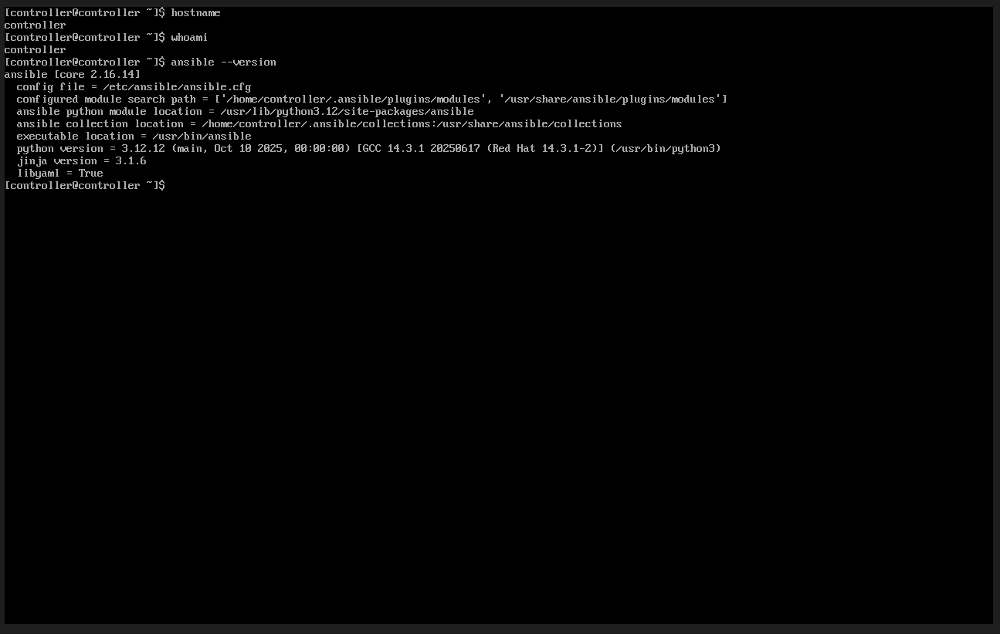
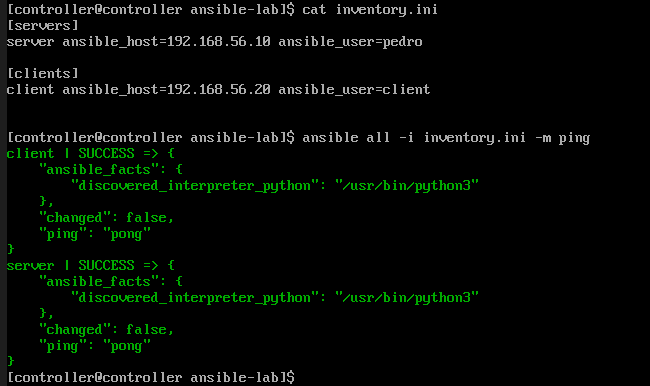
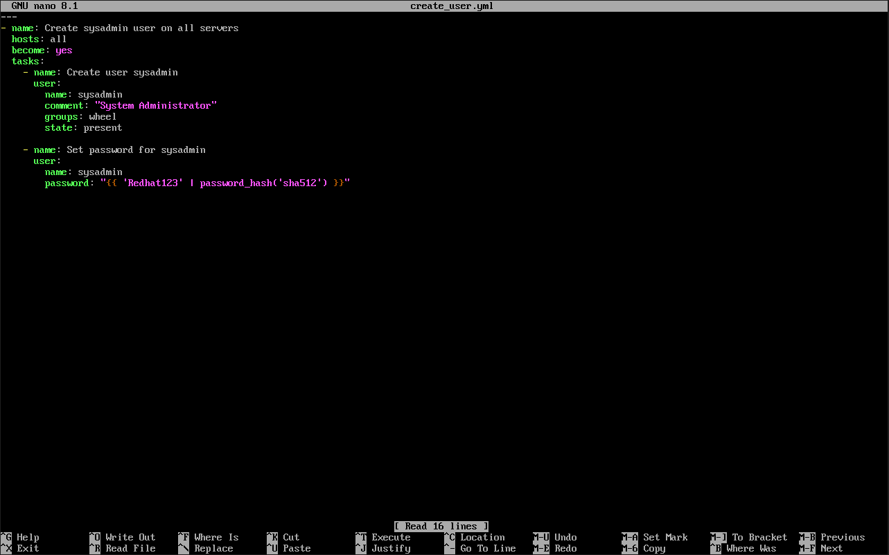
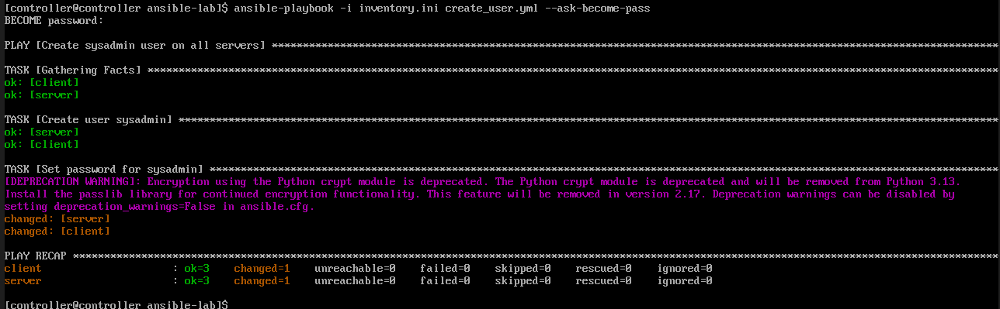

# 🤖 Step 4: Ansible Automation

## Do Tasks Once, Apply to Many Servers

Imagine you need to create a user account on 100 servers. Would you:

**Option A:** Log into each server one-by-one and run commands (takes forever!)

**Option B:** Write it once and let a tool do all 100 for you (smart!)

**Ansible is Option B.** It's an automation tool that runs commands on multiple servers at once.

---

## 🤔 Why Ansible?

| Without Ansible | With Ansible |
|-----------------|--------------|
| SSH to server 1, run command | Write command once |
| SSH to server 2, run command | Ansible runs it everywhere |
| SSH to server 3, run command | ☕ Drink coffee |
| ... repeat 97 more times ... | Done! |
| 😓 Exhausted after hours | 😎 Done in seconds |

**In the real world:** Companies have hundreds or thousands of servers. Manual work doesn't scale!

---

## 📋 The Scenario

### The Ticket

```
📧 From: Security Team
📋 Subject: New Admin Account Needed on ALL Servers

Hi IT,

We need a new admin account "sysadmin" created on ALL servers in our 
environment for emergency access.

This includes:
- Server (192.168.56.10)
- Client (192.168.56.20)
- Any future servers

Please set up automation so we can reuse this for future accounts.

Thanks,
Security Team
```

---

## 🎯 What We'll Do

1. Connect to the Controller (where Ansible runs)
2. Create an "inventory" (list of servers to manage)
3. Create a "playbook" (instructions for Ansible)
4. Run it and watch the magic happen!

---

## Step 4.1: Connect to the Controller

```bash
# From your computer, connect to the Controller
ssh controller@192.168.56.30
```

**Why the Controller?** Ansible runs from one central machine (the Controller) and pushes commands to the others.

---

## Step 4.2: Verify Ansible is Installed

```bash
ansible --version
```



**You should see:** Version information like `ansible [core 2.16.x]`

**If not installed:**
```bash
sudo dnf install ansible-core -y
```

---

## Step 4.3: Create a Working Directory

```bash
mkdir ~/ansible-lab
cd ~/ansible-lab
```

**Why?** Keep your Ansible files organized in one place.

---

## Step 4.4: Create the Inventory File

The inventory tells Ansible: "These are the servers you'll manage."

```bash
nano inventory.ini
```

**Type this:**
```ini
[servers]
server ansible_host=192.168.56.10 ansible_user=pedro

[clients]
client ansible_host=192.168.56.20 ansible_user=client
```

**Save and exit:** Press `Ctrl+O`, `Enter`, then `Ctrl+X`

**Let's break this down:**

```
[servers]                              ← Group name (like a folder)
server                                 ← Nickname for this machine
       ansible_host=192.168.56.10      ← Its IP address
                                ansible_user=pedro   ← Username to log in with
```

**Why groups?** You can run commands on all [servers] or all [clients] or both!

---

## Step 4.5: Test the Connection

Before automating, make sure Ansible can reach your servers:

```bash
ansible all -i inventory.ini -m ping
```



**What this means:**

| Part | Meaning |
|------|---------|
| `ansible` | The Ansible command |
| `all` | Target ALL machines in inventory |
| `-i inventory.ini` | Use this inventory file |
| `-m ping` | Run the "ping" module (tests connection) |

**What you should see:**
```
server | SUCCESS => {
    "ping": "pong"
}
client | SUCCESS => {
    "ping": "pong"
}
```

**SUCCESS** on both = Ansible can talk to your servers! ✅

---

## Step 4.6: Create the Playbook

A playbook is a YAML file that describes WHAT you want Ansible to do.

```bash
nano create_user.yml
```

**Type this EXACTLY (spacing matters!):**
```yaml
---
- name: Create sysadmin user on all servers
  hosts: all
  become: yes
  tasks:
    - name: Create user sysadmin
      user:
        name: sysadmin
        comment: "System Administrator"
        groups: wheel
        state: present

    - name: Set password for sysadmin
      user:
        name: sysadmin
        password: "{{ 'Redhat123' | password_hash('sha512') }}"
```



**Save and exit:** `Ctrl+O`, `Enter`, `Ctrl+X`

---

### Understanding the Playbook

```yaml
---                                          ← Start of YAML file
- name: Create sysadmin user on all servers  ← Description of what we're doing
  hosts: all                                 ← Run on ALL servers in inventory
  become: yes                                ← Use sudo (admin privileges)
  tasks:                                     ← List of things to do
    - name: Create user sysadmin             ← Task 1 description
      user:                                  ← Use the "user" module
        name: sysadmin                       ← Username
        comment: "System Administrator"      ← Full name
        groups: wheel                        ← Make them an admin
        state: present                       ← Make sure they exist

    - name: Set password for sysadmin        ← Task 2 description
      user:
        name: sysadmin
        password: "{{ 'Redhat123' | ... }}"  ← Encrypted password
```

**⚠️ YAML is picky about spacing!** Use spaces, NOT tabs. Each indent is 2 spaces.

---

## Step 4.7: Run the Playbook

Now the magic happens:

```bash
ansible-playbook -i inventory.ini create_user.yml --ask-become-pass
```

**You'll be asked:** `BECOME password:` - Enter the sudo password for the remote servers



**What you should see:**
```
PLAY [Create sysadmin user on all servers] *****

TASK [Gathering Facts] *****
ok: [server]
ok: [client]

TASK [Create user sysadmin] *****
changed: [server]
changed: [client]

TASK [Set password for sysadmin] *****
changed: [server]
changed: [client]

PLAY RECAP *****
client      : ok=3    changed=2    failed=0
server      : ok=3    changed=2    failed=0
```

**How to read this:**
- `ok` = Task completed successfully
- `changed` = Ansible made a change
- `failed=0` = No errors! 🎉

---

## Step 4.8: Verify It Worked

Let's prove the user was created on BOTH servers:

```bash
ansible all -i inventory.ini -m command -a "id sysadmin" --ask-become-pass
```

**You should see:**
```
server | CHANGED | rc=0 >>
uid=1001(sysadmin) gid=1001(sysadmin) groups=1001(sysadmin),10(wheel)

client | CHANGED | rc=0 >>
uid=1001(sysadmin) gid=1001(sysadmin) groups=1001(sysadmin),10(wheel)
```

**The user `sysadmin` exists on BOTH servers with admin access!** ✅

---

## 🤯 What Just Happened?

With ONE command, you:
- Created a user on the Server
- Created a user on the Client
- Gave both admin access
- Set passwords on both

**Imagine doing this on 100 servers!** Ansible saves HOURS of work.

---

## 📊 Manual vs Ansible Comparison

| Task | Manual (2 servers) | Ansible (2 servers) | Ansible (100 servers) |
|------|-------------------|--------------------|-----------------------|
| SSH to each | 2 times | 0 times | 0 times |
| Type commands | 8 commands | 1 command | 1 command |
| Time | ~10 minutes | ~30 seconds | ~2 minutes |
| Chance of typo | High | Very low | Very low |

---

## 📖 Command Reference

| Task | Command |
|------|---------|
| Check Ansible version | `ansible --version` |
| Test connection | `ansible all -i inventory.ini -m ping` |
| Run a playbook | `ansible-playbook -i inventory.ini playbook.yml` |
| Run with sudo password | Add `--ask-become-pass` or `-K` |
| Run command on all servers | `ansible all -m command -a "your command"` |

---

## 💡 Key Lessons

1. **Inventory = Who** - The list of servers to manage

2. **Playbook = What** - The instructions (tasks to perform)

3. **`become: yes` = Sudo** - Run with admin privileges

4. **Idempotent** - Running the playbook twice won't break anything. Ansible only makes changes when needed.

---

## 🔧 Troubleshooting

### "Permission denied"
- Check that SSH keys are set up correctly
- Make sure the username in inventory matches the actual user

### "YAML syntax error"
- Check your spacing! Use 2 spaces per indent
- Make sure you don't have tabs (use spaces only)
- Check for missing colons after keys

### "Host unreachable"
- Check IP addresses in inventory
- Make sure VMs are running
- Test with `ping 192.168.56.10`

---

## 📸 Screenshots for This Section

| Screenshot | Description |
|------------|-------------|
| ansible-version.png | Ansible is installed |
| ansible-ping.png | Connection test succeeded |
| playbook-created.png | The playbook in nano |
| playbook-success.png | Successful playbook run |

---

## ➡️ Next Step

Let's learn about containers - a modern way to run applications:

[Go to Step 5: Container Management →](../06-Container-Management/)
