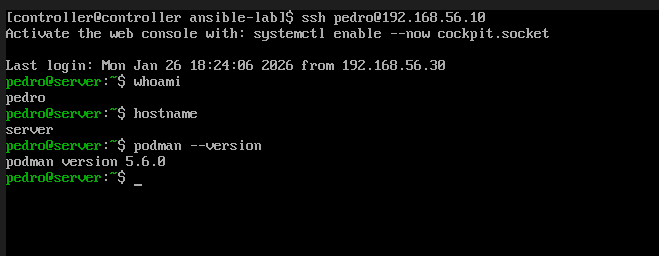
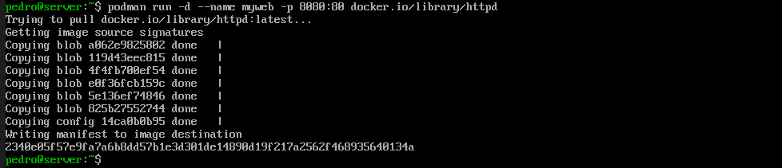
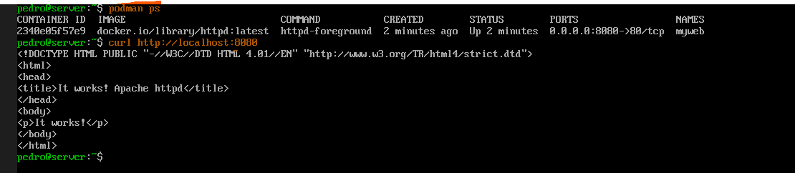
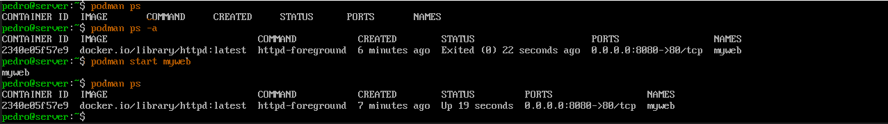
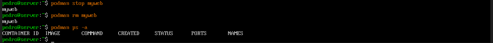

# 📦 Step 5: Container Management

## Running Applications in Boxes

Containers are one of the HOTTEST topics in IT right now. Every job posting mentions them! Let's learn what they are and how to use them.

---

## 🤔 What's a Container?

Imagine you want to run a web server. You have two choices:

### Option 1: Install Directly (Old Way)
```
Your Server
├── Operating System (RHEL)
├── Web Server Software
├── Configuration Files
├── Dependencies (libraries, tools)
└── Your Website
```

**Problems:**
- Installing can break other things
- Hard to move to another server
- "It works on my machine!" syndrome

### Option 2: Container (Modern Way)
```
Your Server
├── Operating System (RHEL)
└── Container Engine (Podman)
    └── Container (self-contained box)
        ├── Mini Operating System
        ├── Web Server Software
        ├── Dependencies
        └── Your Website
```

**Benefits:**
- Everything the app needs is IN the box
- Move the box anywhere, it still works
- Doesn't affect anything outside the box

---

## 🎒 Real-World Analogy

Think of containers like **shipping containers** (that's where the name comes from!):

| Shipping Container | Software Container |
|-------------------|-------------------|
| Standardized box | Standardized format |
| Put stuff inside | Put app + dependencies inside |
| Ship anywhere | Deploy anywhere |
| Doesn't leak | Isolated from host |
| Stack them | Run many containers |

---

## 🔧 Podman vs Docker

You might have heard of **Docker**. Podman is similar but better for RHEL:

| Feature | Docker | Podman |
|---------|--------|--------|
| Needs daemon | Yes (runs in background) | No |
| Needs root | Usually | No (rootless!) |
| RHEL default | No | Yes ✅ |
| Commands | `docker ...` | `podman ...` (same!) |

**Good news:** If you learn Podman, you basically know Docker too!

---

## 📋 The Scenario

### The Ticket

```
📧 From: Development Team
📋 Subject: Quick Web Server for Testing

Hi IT,

We need a temporary web server for testing our new application.
We don't want to install Apache directly on the server.

Can you spin up a containerized web server on Server (192.168.56.10)?
We just need to verify it works.

Thanks,
Dev Team
```

---

## Step 5.1: Connect to the Server

```bash
ssh pedro@192.168.56.10
```

---

## Step 5.2: Verify Podman is Installed

```bash
podman --version
```



**You should see:** `podman version 5.x.x`

---

## Step 5.3: Run Your First Container!

```bash
podman run -d --name myweb -p 8080:80 docker.io/library/httpd
```



**Wow, that's a lot! Let's break it down:**

| Part | What It Means |
|------|---------------|
| `podman run` | "Start a container" |
| `-d` | "Detached" - run in background |
| `--name myweb` | "Call this container 'myweb'" |
| `-p 8080:80` | "Connect port 8080 on server to port 80 in container" |
| `docker.io/library/httpd` | "Use this Apache image" |

### What's an "image"?

An **image** is like a recipe:
- It contains everything needed to create a container
- Download once, create many containers from it
- Think of it like a cookie cutter (image) vs actual cookies (containers)

---

## Step 5.4: Check if It's Running

```bash
podman ps
```



**You should see:**
```
CONTAINER ID  IMAGE                           STATUS         PORTS                 NAMES
abc123def456  docker.io/library/httpd:latest  Up 2 minutes   0.0.0.0:8080->80/tcp  myweb
```

**Key things:**
- `STATUS: Up 2 minutes` = It's running! ✅
- `PORTS: 0.0.0.0:8080->80/tcp` = Port forwarding is set up ✅

---

## Step 5.5: Test the Web Server

```bash
curl http://localhost:8080
```

**You should see:**
```html
<html><body><h1>It works!</h1></body></html>
```

**🎉 You just ran a web server in a container!**

---

## 📊 What Just Happened?

```
┌─────────────────────────────────────────────────────┐
│                YOUR SERVER                          │
│                                                     │
│   ┌─────────────────────────────────────────────┐   │
│   │            Container: myweb                 │   │
│   │   ┌─────────────────────────────────────┐   │   │
│   │   │         Apache Web Server           │   │   │
│   │   │         (httpd on port 80)          │   │   │
│   │   └─────────────────────────────────────┘   │   │
│   └──────────────────┬──────────────────────────┘   │
│                      │                              │
│                 Port 8080                           │
│                      │                              │
│   ───────────────────┴─────────────────────────     │
│                                                     │
│     curl http://localhost:8080                      │
│                      │                              │
│                      ▼                              │
│                 "It works!"                         │
│                                                     │
└─────────────────────────────────────────────────────┘
```

The web server runs INSIDE the container, completely isolated from your server!

---

## Step 5.6: Container Lifecycle Commands

### Stop the Container
```bash
podman stop myweb
```

### Check if It Stopped
```bash
podman ps          # Shows nothing (only running containers)
podman ps -a       # Shows ALL containers (including stopped)
```



### Start It Again
```bash
podman start myweb
podman ps
```

### Remove the Container
```bash
podman stop myweb
podman rm myweb
podman ps -a       # Should be empty now!
```



---

## 🔄 The Container Lifecycle

```
         ┌──────────┐
         │  Image   │  (Recipe - download once)
         └────┬─────┘
              │
              │  podman run
              ▼
         ┌──────────┐
         │ Running  │  (Container is active)
         └────┬─────┘
              │
              │  podman stop
              ▼
         ┌──────────┐
         │ Stopped  │  (Paused, can restart)
         └────┬─────┘
              │
    ┌─────────┴─────────┐
    │                   │
    │ podman start      │ podman rm
    │                   │
    ▼                   ▼
┌──────────┐      ┌──────────┐
│ Running  │      │ Deleted  │
└──────────┘      └──────────┘
```

---

## 📖 Command Reference

| Task | Command |
|------|---------|
| Run a container | `podman run -d --name NAME -p PORT:PORT IMAGE` |
| List running containers | `podman ps` |
| List ALL containers | `podman ps -a` |
| Stop a container | `podman stop NAME` |
| Start a stopped container | `podman start NAME` |
| Remove a container | `podman rm NAME` |
| List downloaded images | `podman images` |
| View container logs | `podman logs NAME` |

---

## 💡 Key Lessons

1. **Containers are isolated** - They can't break your main system

2. **Images vs Containers** - Image = recipe, Container = actual running thing

3. **Port mapping** - `-p 8080:80` connects outside world to container

4. **Disposable** - Don't like it? Delete and recreate in seconds!

---

## 🔧 Common Options for `podman run`

| Option | What It Does | Example |
|--------|--------------|---------|
| `-d` | Run in background | `-d` |
| `--name` | Give it a name | `--name myapp` |
| `-p` | Map ports | `-p 8080:80` |
| `-e` | Set environment variable | `-e PASSWORD=secret` |
| `-v` | Mount a folder | `-v /data:/container/data` |
| `--rm` | Auto-delete when stopped | `--rm` |

---

## 🔧 Troubleshooting

### "Port already in use"
Something else is using that port. Try a different one:
```bash
podman run -d --name myweb -p 9090:80 docker.io/library/httpd
```

### "Permission denied"
Make sure you're logged in as a regular user, not root.

### Container keeps stopping
Check the logs:
```bash
podman logs myweb
```

---

## 📸 Screenshots for This Section

| Screenshot | Description |
|------------|-------------|
| podman-version.png | Podman is installed |
| podman-run.png | Starting the container |
| podman-ps-curl.png | Container running + curl test |
| container-lifecycle.png | Stop/start commands |
| container-removed.png | Container deleted |

---

## ➡️ Next Step

Finally, let's learn how to document your work like a professional:

[Go to Step 6: Ticket Documentation →](../07-Ticket-Documentation/)
